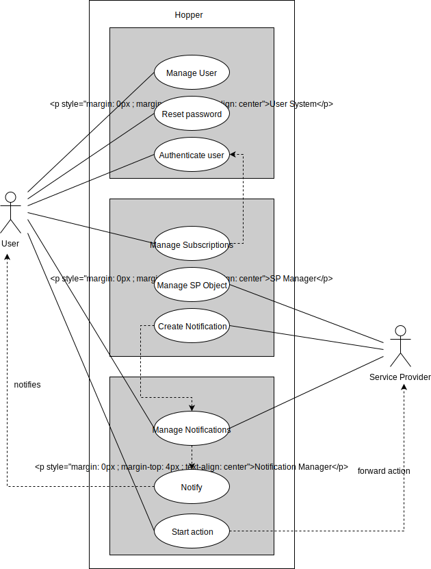

# SRS  

## Table of Contents  

- [1. Introduction](#1-introduction)
  * [1.1 Purpose](#11-purpose)
  * [1.2 Scope](#12-scope)
  * [1.3 Definitions, Acronyms, and Abbreviations](#13-definitions-acronyms-and-abbreviations)
  * [1.4 References](#14-references)
  * [1.5 Overview](#15-overview)
- [2. Overall Description](#2-overall-description)
  * [2.1 Vision](#21-vision)
  * [2.2 Use Case Diagram](#22-use-case-diagram)
- [3. Specific Requirements](#3-specific-requirements)
  * [3.1 Functionality](#31-functionality)
    + [3.1.1 Create user](#311-create-user)
    + [3.1.2 Create user Session](#312-create-user-session)
    + [3.1.3 Reset user password](#313-reset-user-password)
    + [3.1.4 Register SP in Backend](#314-register-sp-in-backend)
    + [3.1.5 Subscribe user to SP](#315-subscribe-user-to-sp)
    + [3.1.6 Unsubscribe user from SP](#316-unsubscribe-user-from-sp)
    + [3.1.7 Push notification](#317-push-notification)
    + [3.1.8 Delete notification](#318-delete-notification)
    + [3.1.9 Update notification](#319-update-notification)
    + [3.1.10 Mark notification as done](#3110-mark-notification-as-done)
    + [3.1.11 Notify user](#3111-notify-user)
    + [3.1.12 Start action](#3112-start-action)
    + [3.1.13 Delete user](#3113-delete-user)   
    + [3.1.14 Delete user](#3114-filter-for-sp)
  * [3.2 Usability](#32-usability)
    + [3.2.1 Usable in web browsers](#321-usable-in-web-browsers)
  * [3.3 Reliability](#33-reliability)
    + [3.3.1 Server reliablility](#331-server-reliablility)
  * [3.4 Performance](#34-performance)
    + [3.4.1 Notification delivery time](#341-notification-delivery-time)
  * [3.5 Supportability](#35-supportability)
    + [3.5.1 Language Support](#351-language-support)
    + [3.5.2 Modularity](#352-modularity)
  * [3.6 Design Constraints](#36-design-constraints)
    + [3.6.1 MVC architecture](#361-mvc-architecture)
  * [3.7 On-line User Documentation and Help System Requirements](#37-on-line-user-documentation-and-help-system-requirements)
    + [3.7.1 User Guide](#371-user-guide)
    + [3.7.2 Development Guide](#372-development-guide)
  * [3.8 Purchased Components](#38-purchased-components)
  * [3.9 Interfaces](#39-interfaces)
    + [3.9.1 User Interfaces](#391-user-interfaces)
    + [3.9.2 Hardware Interfaces](#392-hardware-interfaces)
    + [3.9.3 Software Interfaces](#393-software-interfaces)
    + [3.9.4 Communications Interfaces](#394-communications-interfaces)
  * [3.10 Licensing Requirements](#310-licensing-requirements)
    + [3.10.1 Licensing data from SPs](#3101-licensing-data-from-sps)
  * [3.11 Legal, Copyright and Other Notices](#311-legal-copyright-and-other-notices)
  * [3.12 Application Standards](#312-application-standards)
    + [3.12.1 REST](#3121-rest)
- [4. Supporting Information](#4-supporting-information)

## 1. Introduction  

### 1.1 Purpose  
Hopper is a tool, which allows you to merge your information streams into a simple, easy-to-use and extendable interface. It is independent from where you are, what device you are using or what kind of information you are receiving.  

### 1.2 Scope  

This software specification applies for the hopper server. Users will be able to register the specified services and their respective notifications will be funneled into one dashboard.  

### 1.3 Definitions, Acronyms, and Abbreviations  

| Acronyms/Abbreviation | Explaination                                        |
|-----------------------|-----------------------------------------------------|
| UC                    | Use Case                                            |
| UCD                   | Use Case Diagram                                    |
| SP                    | Service Provider (individual service e.g. Telegram) |  

### 1.4 References  

* [Agile Project Dashboard](https://youtrack.hoppercloud.net/agiles/)
* [Build Dashboard](https://teamcity.hoppercloud.net/)
* [Blog](https://blog.hoppercloud.net/)  

### 1.5 Overview  

The following chapters describe the system requirements for the hopper project.

## 2. Overall Description  

### 2.1 Vision  

Today, we are living in a time of abundance. Be it materialistic or informational. It is quite easy to access all information in the world within seconds, but it is quite difficult to keep track of the information you really need.

We are introducing a way to overcome this challenge – with hopper. Hopper is a tool, which allows you to merge your information streams into a simple, easy-to-use and extendable interface. It is independent from where you are, what device you are using or what kind of information you are receiving.

The majority of information streams are based on notifications. You receive them, usually on your phone, and try to keep track of them all. Hopper is a central place for your notifications. It keeps track of them and lets you filter them, to only keep track of what is really important to you.

### 2.2 Use Case Diagram
  
*The scope for the timespan until December, is to implement the hopper server (what you see above). In the next development cycle (from April to June) we will implement some default service providers and a provider store.*

## 3. Specific Requirements  

### 3.1 Functionality
#### 3.1.1 Create user
Create an user in the backend
#### 3.1.2 Create user Session
User logs in, after that a session has to be created
#### 3.1.3 Reset user password
The user forgets his password, the password has to be reset
#### 3.1.4 Register SP in Backend
Before a SP has to register before users can subscribe 
#### 3.1.5 Subscribe user to SP
The user can subscribe to a SP (authentication is important)
#### 3.1.6 Unsubscribe user from SP
User will no longer receive notifications from that SP
#### 3.1.7 Push notification
A SP can push notifications to a user that has subscribed to it
#### 3.1.8 Delete notification
The SP can delete the previously pushed notification
#### 3.1.9 Update notification
The SP can update the previously pushed notification
#### 3.1.10 Mark notification as done
The user can mark a notification it received as done, it will not show on the overview page

[Use Case Documentation](./uc-set-notification-done.md)
#### 3.1.11 Notify user
The user can be notified of an incoming notification
#### 3.1.12 Start action
The user can start actions provided with the notifications
#### 3.1.13 Delete user
All user data can be deleted
#### 3.1.14 Filter for SP
Filter notifications for one specific SP

[Use Case Documentation](./uc-filter-for-sp.md)

### 3.2 Usability
#### 3.2.1 Usable in web browsers
The application should be fully functional in the most common used modern web browsers (Chrome, Firefix, Edge, Safari, Opera)

### 3.3 Reliability
#### 3.3.1 Server reliablility
The production server should have an uptime of 99% of the time that is in our control. 

The server is hosted by NetCup, outages caused by them cannot be accounted for.

### 3.4 Performance
#### 3.4.1 Notification delivery time
When a user is online, a notification that is pushed by a SP, should be delivered within one second.

### 3.5 Supportability
#### 3.5.1 Language Support
The backend and the frontend will be implemented using TypeScript. It will probably be supported in the future because Microsoft is actively using it.
#### 3.5.2 Modularity
The backend and frontend will be separated and communicate by a well-defined API. This makes the components supportable on their own.

### 3.6 Design Constraints
#### 3.6.1 MVC architecture
The application should use a MVC architecture. The Model will be on the backend, the view and the controller will be in the frontend.

### 3.7 On-line User Documentation and Help System Requirements
#### 3.7.1 User Guide
There will be an online user guide to introduce users to hopper.
#### 3.7.2 Development Guide
There will be an online development guide to help developers implement new SPs.

### 3.8 Purchased Components
not applicable

### 3.9 Interfaces
#### 3.9.1 User Interfaces
(tbd)
#### 3.9.2 Hardware Interfaces
not applicable
#### 3.9.3 Software Interfaces
(tbd)
#### 3.9.4 Communications Interfaces
(tbd)

### 3.10 Licensing Requirements
#### 3.10.1 Licensing data from SPs
Because we won't implement SPs that require licensing ourselves, we do not have to worry about licensing. When publishing a SP, you automatically grant all required licenses to hopper.

### 3.11 Legal, Copyright and Other Notices
(tbd)

### 3.12 Application Standards
#### 3.12.1 REST
We will use a RESTful APIs to communicate with the backend.

## 4. Supporting Information
(tbd)
