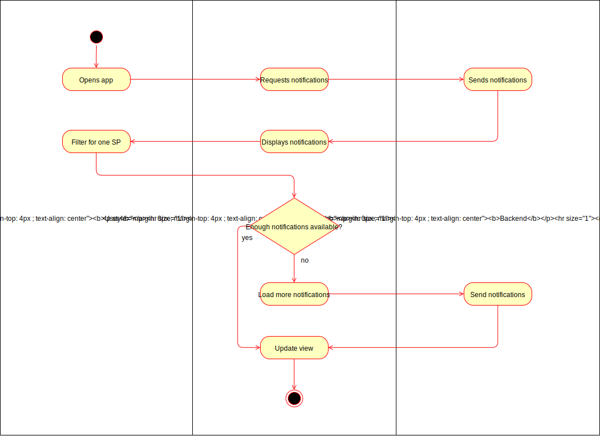

# 1 UC: Filter notifications for one SP

## 1.1 Brief Description
Every user will receive notifications. These notifications will be filterable by the SP which sent them.

When the user selects one SP, only notifications by this SP should be visible.

# 2 Flow of Events
## 2.1 Basic Flow
- User selects one SP from the list of the providers
- Only notifications from this SP will be visible

### 2.1.1 Activity Diagram

### 2.1.2 Mock-up

## 2.2 Alternative Flows
(n/a)

# 3 Special Requirements
(n/a)

# 4 Preconditions
## 4.1 Logged in
The user has to be logged in to the system.
## 4.2 User has at least one notification
The user has to have at least one notification in the current filter for the SP to become visible, to filter for it.

# 5 Postconditions
## 5.1 SP highlighted
The selected SP is highlighted in some way.
## 5.2 Only SP's notifications visible
Only the notifications, sent by the selected SP, will be visible.
 
# 6 Extension Points
(n/a)
