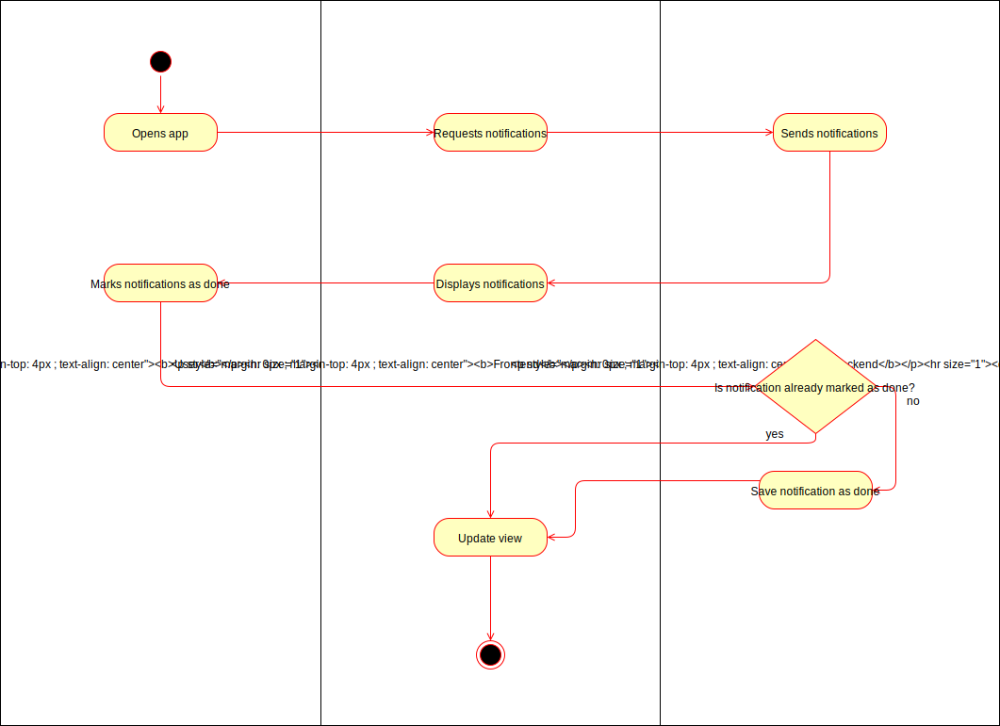
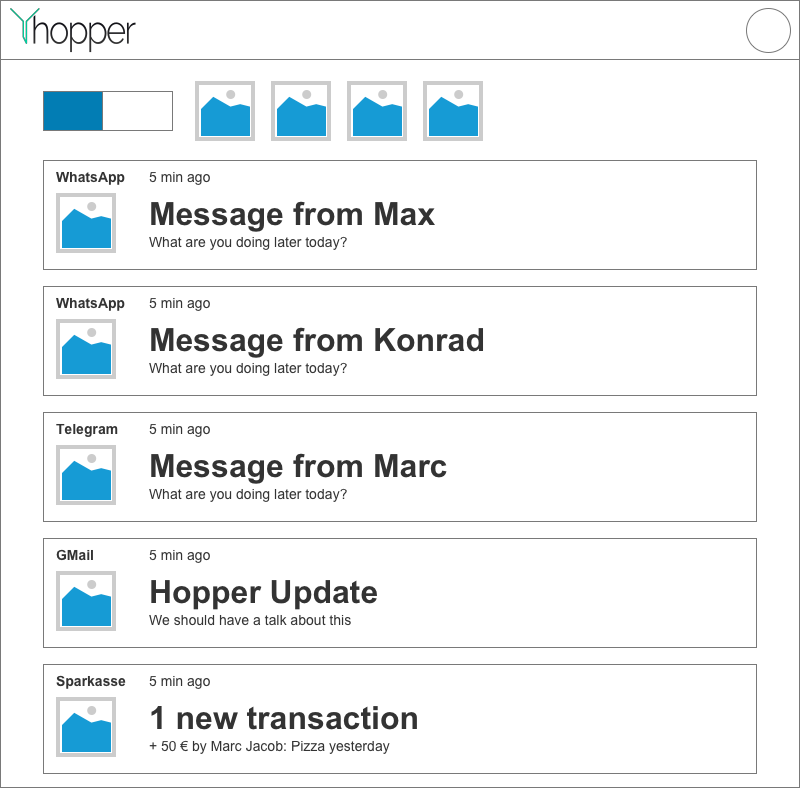

# 1 UC: Set notification to done

## 1.1 Brief Description
Every user will receive notifications. These notifications should not be deleted, because this will break the search and archiving capabilities. 

Instead, the user can mark the notification as "done", what makes them disappear from the default view. They will still be searchable.
# 2 Flow of Events
## 2.1 Basic Flow
- User hovers over a notification
- User clicks on the "mark as done" icon (probably a check mark)
- The notification is marked as done, will disappear when the user is on the default view

### 2.1.1 Activity Diagram


### 2.1.2 Mock-up


### 2.1.3 Narrative
The productive gherkin file can be found [in the project](./../frontend/test/notification_done.feature).
````gherkin
Feature: Mark notification as done

  Scenario: Simple marking and disappear
    Given User is on hopper
    And User is logged in
    And User has open Notification "Test" by "TestApp"
    And No AppFilter is selected
    And Checkbox "SeeAllNotifications" is not checked
    When User clicks on button "done" in Notification "Test"
    Then Notification "Test" should be done
    And Notification "Test" should not be visible

  Scenario: Simple marking and no disappear
    Given User is on hopper
    And User is logged in
    And User has open Notification "Test" by "TestApp"
    And No AppFilter is selected
    And Checkbox "SeeAllNotifications" is checked
    When User clicks on button "done" in Notification "Test"
    Then Notification "Test" should be done
    And Notification "Test" should be visible

  Scenario: App Selected and disappear
    Given User is on hopper
    And User is logged in
    And User has open Notification "Test" by "TestApp"
    And AppFilter "TestApp" is selected
    And Checkbox "SeeAllNotifications" is not checked
    When User clicks on button "done" in Notification "Test"
    Then Notification "Test" should be done
    And Notification "Test" should not be visible

  Scenario: App Selected and no disappear
    Given User is on hopper
    And User is logged in
    And User has open Notification "Test" by "TestApp"
    And AppFilter "TestApp" is selected
    And Checkbox "SeeAllNotifications" is checked
    When User clicks on button "done" in Notification "Test"
    Then Notification "Test" should be done
    And Notification "Test" should be visible

````
## 2.2 Alternative Flows
(n/a)

# 3 Special Requirements
(n/a)

# 4 Preconditions
## 4.1 Logged in
The user has to be logged in to the system.
## 4.2 Notification available
The user has to have a notification which is not marked as done.

# 5 Postconditions
## 5.1 Notification done
The notification is marked as done.
## 5.2 Removed from overview
The notification is not visible anymore when the user does explicitly makes notifications marked as done visible.
 
# 6 Extension Points
## 6.1 Todo
Mark notification as done temporarily.
